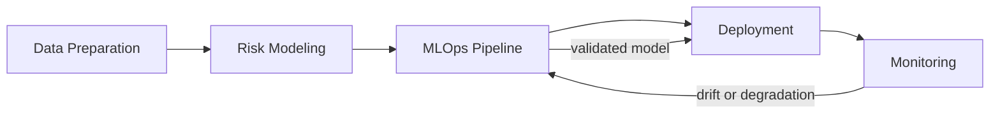

# Adaptive P2P Risk

**Adaptive Risk Management System: MLOps and Continual Learning for Collaborative Insurance**

Adaptive P2P Risk is an academic MLOps project for collaborative insurance risk scoring. It builds a full local pipeline that prepares the freMTPL2 motor insurance dataset, constructs synthetic peer-to-peer pools, trains calibrated risk models, simulates temporal drift, validates retraining candidates, and serves the selected model through a monitored API.

> PFA internship project - ENSIAS 2IA x Smart Automation Technologies, July-August 2026.


## What This Project Does

The system scores insurance risk at two levels:

- **Contract level:** claim probability for an individual policy.
- **Pool level:** aggregated risk score for a peer-to-peer insurance pool.

It also keeps the model lifecycle auditable:

- raw data validation and cleaning reports;
- reproducible pool construction and feature engineering;
- DVC dataset snapshot metadata;
- calibrated model training reports;
- drift detection against a known synthetic stream;
- MLflow tracking and local registry promotion attempts;
- Dockerized FastAPI and Streamlit deployment;
- Prometheus metrics, Grafana dashboard provisioning, and risk-decision trace logs.

## Architecture



| Block | Main Modules | Purpose |
|---|---|---|
| Data preparation | `src/data/*` | Ingestion, cleaning, pool construction, features, streaming, DVC version report |
| Risk modeling | `src/models/risk.py` | Contract claim model, pool scores, anomaly scores |
| Continual learning | `src/continual/drift.py` | PSI/residual drift detection and sliding-window retraining signals |
| MLOps | `src/mlops/pipeline.py` | MLflow run tracking, candidate validation, local registry promotion |
| Deployment | `src/api/app.py`, `demo/app.py` | FastAPI scoring service and Streamlit demo |
| Monitoring | `src/monitoring/*`, `monitoring/` | Prometheus metrics, Grafana dashboards, alerts, traceability reports |

## Dataset

The project uses **freMTPL2**, a French motor third-party liability insurance dataset with separate frequency and severity files:

- `freMTPL2freq.csv`: 678,013 policies with exposure, vehicle, driver, region, and claim count fields.
- `freMTPL2sev.csv`: 26,639 claim records with claim amounts.

The dataset does not contain collaborative-insurance pools or temporal drift signals. This repository constructs both:

- pools are simulated with deterministic clustering in Phase 3;
- temporal batches and drift ground truth are simulated in Phase 5.

Real CSVs are not committed. Place them manually in:

```text
data/raw/freMTPL2freq.csv
data/raw/freMTPL2sev.csv
```

## Repository Layout

```text
adaptive-p2p-risk/
├── data/
│   ├── raw/                 # gitignored input CSVs
│   └── processed/           # gitignored generated data artifacts
├── artifacts/               # gitignored model, MLOps, deployment, monitoring outputs
├── src/
│   ├── data/                # Phases 1-6
│   ├── models/              # Phase 7
│   ├── continual/           # Phase 8
│   ├── mlops/               # Phase 9
│   ├── api/                 # Phase 10
│   └── monitoring/          # Phase 11
├── tests/                   # synthetic-data test suite
├── demo/                    # Streamlit demo
├── monitoring/              # Prometheus and Grafana configuration
├── .github/workflows/       # CI
├── AGENTS.md                # project roadmap and implementation rules
├── Guide.md                 # operational phase-by-phase guide
├── pyproject.toml
├── uv.lock
└── README.md
```

## Quick Start

Install dependencies with uv:

```bash
uv sync --all-groups
```

Run the test suite:

```bash
uv run pytest
```

Place the freMTPL2 CSVs in `data/raw/`, then run the full local pipeline:

```bash
uv run python -m src.data.cleaning
uv run python -m src.data.pools
uv run python -m src.data.features
uv run python -m src.data.streaming
uv run python -m src.data.versioning
uv run python -m src.models.risk
uv run python -m src.continual.drift
uv run python -m src.mlops.pipeline --dvc-status-check
uv run python -m src.monitoring.traceability
```

For the complete phase-by-phase explanation, inputs, outputs, and optional flags, see [Guide.md](./Guide.md).

## Running the API and Demo

Run locally without Docker:

```bash
uv run uvicorn src.api.app:app --host 0.0.0.0 --port 8000
API_BASE_URL=http://localhost:8000 uv run streamlit run demo/app.py
```

Run the Docker Compose stack:

```bash
docker compose up --build
```

Services:

| Service | URL | Notes |
|---|---|---|
| FastAPI | `http://localhost:8000` | `/health`, `/model/version`, `/metrics`, `/score/contract`, `/score/pool` |
| Streamlit demo | `http://localhost:8501` | UI wrapper around the API |
| Prometheus | `http://localhost:9090` | Scrapes API metrics |
| Grafana | `http://localhost:3000` | Login: `admin` / `admin` |

The API resolves the serving model in this order:

1. `MODEL_ARTIFACT_PATH` environment override;
2. validated Phase 9 retrained candidate;
3. accepted Phase 7 reference model.

Decision tracing is privacy-aware. The API does not log full request or response payloads. For reproducible salted fingerprints, set `TRACE_HASH_SALT`. For local demos only, Compose sets `TRACE_DEV_MODE=true`, which uses an ephemeral per-process salt. If neither variable is set, decision trace logging is disabled instead of falling back to a weak fixed salt.

## Current Status

All roadmap phases in [AGENTS.md](./AGENTS.md) are implemented and tested for the approved scope:

- Phases 0-6: data preparation and dataset versioning.
- Phase 7: calibrated contract-risk model, pool scores, anomaly scores.
- Phase 8: data/concept drift detection and retraining-event generation.
- Phase 9: MLflow tracking, candidate validation, local registry attempt.
- Phase 10: FastAPI, Docker, CI, Streamlit demo.
- Phase 11: Prometheus metrics, Grafana dashboard, alert rules, traceability logs.

Known scope notes:

- Phase 3 pool methodology and Phase 8 drift latency threshold remain documented as supervisor sign-off items.
- Kafka streaming simulation and Kubernetes orchestration are optional Could items and are intentionally deferred.
- `/score/pool` supports member-list scoring. Pool-id-only lookup is deferred until a database or feature store exists.

Latest verification in this workspace:

```text
98 passed
```

## Main Technologies

| Area | Tools |
|---|---|
| Environment | Python 3.11+, uv |
| Data | pandas, NumPy |
| Modeling | scikit-learn |
| Versioning and tracking | DVC, MLflow |
| API and demo | FastAPI, Uvicorn, Streamlit |
| Monitoring | prometheus-client, Prometheus, Grafana |
| Delivery | Docker, Docker Compose, GitHub Actions |

## Documentation

- [Guide.md](./Guide.md): operational guide with every phase, command, and output.
- [AGENTS.md](./AGENTS.md): implementation roadmap, conventions, and progress checklist.
- JSON reports in `data/processed/` and `artifacts/`: auditable outputs for each phase.

---

<p align="center"><sub>SALHI Aymane - ENSIAS 2IA - PFA Internship 2026</sub></p>
