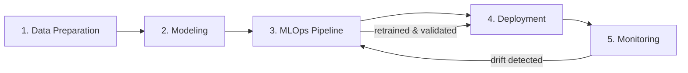

# Adaptive P2P Risk

**Adaptive Risk Management System: MLOps and Continual Learning for Collaborative Insurance**

A machine learning system that continuously re-evaluates insurance risk — at both the individual **contract** level and the collective **pool** level — for a collaborative (peer-to-peer) insurance setting, using continual learning and drift detection to stay accurate as data evolves.

> PFA (Projet de Fin d'Année) summer internship — ENSIAS (Ingénierie Intelligence Artificielle, 2IA) × Smart Automation Technologies, July–August 2026.

[](https://www.python.org/)
[]()
[]()

---

## Table of Contents

- [Adaptive P2P Risk](#adaptive-p2p-risk)
  - [Table of Contents](#table-of-contents)
  - [Context](#context)
  - [Problem Statement](#problem-statement)
  - [Architecture](#architecture)
  - [Dataset](#dataset)
  - [Repository Structure](#repository-structure)
  - [Getting Started](#getting-started)
  - [Usage](#usage)
  - [Tech Stack](#tech-stack)
  - [Project Status](#project-status)
  - [Documentation](#documentation)

## Context

Collaborative (peer-to-peer) insurance lets groups of policyholders share risk directly with one another through a digital platform, instead of transferring it entirely to a centralized insurer. Because pools are continuously reshuffled and policyholder behavior evolves, a risk model trained once and left static quickly becomes inaccurate — both at the individual contract level and at the level of the pool as a whole.

This project builds a system that keeps re-evaluating itself: it detects when the data it sees no longer matches what it was trained on (data drift) or when the underlying relationship between risk factors and claims has changed (concept drift), and retrains automatically when that happens — packaged as a full MLOps pipeline rather than a one-off notebook.

The project is carried out at **Smart Automation Technologies** (Tangier), supervised by **Dr. Amina Jbilou** (Intelligent Automation & BioMed Genomics Laboratory), with **Pr. A. El Afia** (ENSIAS) as academic supervisor.

## Problem Statement

> How can a risk management system be designed to continuously re-evaluate itself, at both the individual contract level and the collective pool level, in the face of data that evolves over time?

## Architecture

The system is a continuous MLOps pipeline made of five blocks, structured as a **closed feedback loop** rather than a linear sequence:



| # | Block | Role |
|---|-------|------|
| 1 | **Data Preparation** | Contract/pool structuring, feature engineering, temporal stream simulation |
| 2 | **Modeling** | Risk-scoring and claim-prediction models, contract and pool level |
| 3 | **MLOps Pipeline** | Experiment tracking, model registry, retraining orchestration |
| 4 | **Deployment** | REST API + demo interface, containerized |
| 5 | **Monitoring** | Drift detection, traceability, alerting — the only component authorized to trigger retraining |

Full requirements (34 functional + 8 non-functional, MoSCoW-prioritized) live in the project's **Cahier des Charges Techniques (CdCT)** — see [Documentation](#documentation).

## Dataset

The working base dataset is **[freMTPL2](https://huggingface.co/datasets/mabilton/fremtpl2)** — French motor third-party liability insurance, frequency + severity files (~678k policies, ~26.6k claims). It provides realistic individual risk attributes but does **not** natively include a collaborative-insurance pool structure or a temporal drift signal — both are constructed by this project's data pipeline (see `src/data/pools.py` and `src/data/streaming.py`).

Real data files are **not** committed to this repository (see `data/raw/.gitignore`). Download `freMTPL2freq.csv` and `freMTPL2sev.csv` from the link above and place them in `data/raw/` before running the pipeline.

## Repository Structure

```
adaptive-p2p-risk/
├── data/
│   ├── raw/              # gitignored — place freMTPL2 CSVs here
│   └── processed/        # gitignored — pipeline outputs, DVC-tracked
├── src/
│   ├── data/              # ingestion, cleaning, pools, features, streaming, versioning
│   ├── models/             # contract & pool risk models
│   ├── continual/          # drift detection, incremental learning
│   ├── mlops/               # MLflow/DVC integration, retraining orchestration
│   ├── api/                  # FastAPI app
│   └── monitoring/          # Prometheus/Grafana hooks, alerting, logging
├── tests/                  # mirrors src/ structure
├── notebooks/               # exploration only, not a dependency of src/
├── demo/                    # Streamlit demo app
├── .github/workflows/        # CI/CD
├── AGENTS.md                 # implementation roadmap & conventions for coding agents
├── requirements.txt
└── README.md
```

## Getting Started

```bash
# Clone the repository
git clone https://github.com/Eymeee/adaptive-p2p-risk.git
cd adaptive-p2p-risk

# Install dependencies (uv)
uv sync

# Download freMTPL2freq.csv and freMTPL2sev.csv from
# https://huggingface.co/datasets/mabilton/fremtpl2
# and place them in data/raw/

# Run the test suite (uses synthetic mock data, no real CSVs required)
uv run pytest
```

## Usage

Each data pipeline stage can be run independently as a CLI module:

```bash
uv run python -m src.data.ingestion    # FR-DM-01 — load & validate raw CSVs
uv run python -m src.data.cleaning     # FR-DM-02 — resolve known data-quality issues
uv run python -m src.data.pools        # FR-DM-03 — construct collaborative-insurance pools
uv run python -m src.data.features     # FR-DM-04 — contract & pool feature/target tables
uv run python -m src.data.streaming    # FR-DM-05 — temporal batches + injected drift
uv run python -m src.data.versioning   # FR-DM-06 — DVC dataset snapshot + version report
uv run python -m src.models.risk       # FR-RM-* — train risk and anomaly models
uv run python -m src.continual.drift   # FR-CL-* — replay stream and detect drift
uv run python -m src.mlops.pipeline    # FR-ML-* — track, validate, and promote candidates
```

Run the Phase 10 API and demo locally:

```bash
uv run uvicorn src.api.app:app --host 0.0.0.0 --port 8000
API_BASE_URL=http://localhost:8000 uv run streamlit run demo/app.py
```

The API serves validated artifacts only. It checks `MODEL_ARTIFACT_PATH` first,
then a validated Phase 9 candidate, then the accepted Phase 7 reference model.
Pool scoring currently supports member-list requests; pool-id-only lookup is
deferred until a deployment database or feature store exists.

Docker:

```bash
docker build -t adaptive-p2p-risk-api .
docker compose up --build
```

Every stage writes both its output artifacts and a JSON audit report to `data/processed/`, documenting exactly what was done (row counts, thresholds applied, modeling decisions made) — nothing is transformed silently.

## Tech Stack

| Category | Tools |
|---|---|
| Language & data | Python, NumPy, Pandas |
| Machine Learning | Scikit-learn, XGBoost, PyTorch / TensorFlow |
| MLOps | MLflow, DVC, Apache Kafka, Kubeflow |
| Deployment | Docker, Kubernetes, FastAPI |
| Monitoring | Prometheus, Grafana |
| Visualization / demo | Plotly, Streamlit |
| CI/CD | GitHub Actions |

## Project Status

Development follows a 12-phase roadmap defined in [`AGENTS.md`](./AGENTS.md), each phase tied to specific requirements from the CdCT.

- [x] Phase 0 — Repo & Environment Setup
- [x] Phase 1 — Data Ingestion (`FR-DM-01`)
- [x] Phase 2 — Data Cleaning (`FR-DM-02`)
- [x] Phase 3 — Pool Construction (`FR-DM-03`)
- [x] Phase 4 — Feature Engineering (`FR-DM-04`)
- [x] Phase 5 — Temporal Stream Simulation (`FR-DM-05`)
- [x] Phase 6 — Dataset Versioning (`FR-DM-06`)
- [x] Phase 7 — Risk Modeling (`FR-RM-*`)
- [x] Phase 8 — Continual Learning & Drift Detection (`FR-CL-*`)
- [x] Phase 9 — MLOps Pipeline (`FR-ML-*`)
- [ ] Phase 10 — Deployment (`FR-DP-*`) — implemented, Docker build verification blocked by local daemon permissions
- [ ] Phase 11 — Monitoring & Traceability (`FR-MT-*`)

See `AGENTS.md` for the full checklist, per-requirement breakdown, and the modeling decisions still pending supervisor sign-off.

## Documentation

The full set of project deliverables (technical specifications, dataset documentation, related work, architecture diagrams) is maintained alongside this codebase:

- **Cahier des Charges Techniques (CdCT)** — full functional & non-functional requirements
- **Dataset Documentation** — freMTPL2 structure, known data-quality issues, cleaning conventions
- **Related Work** — collaborative insurance risk-sharing literature
- **AGENTS.md** — implementation roadmap and conventions for this repository

---

<p align="center"><sub>SALHI Aymane — ENSIAS 2IA — PFA Internship 2026</sub></p>
